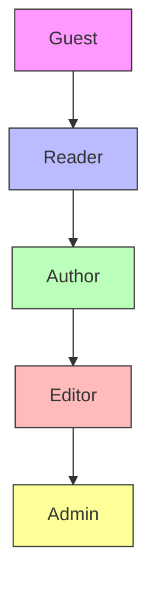
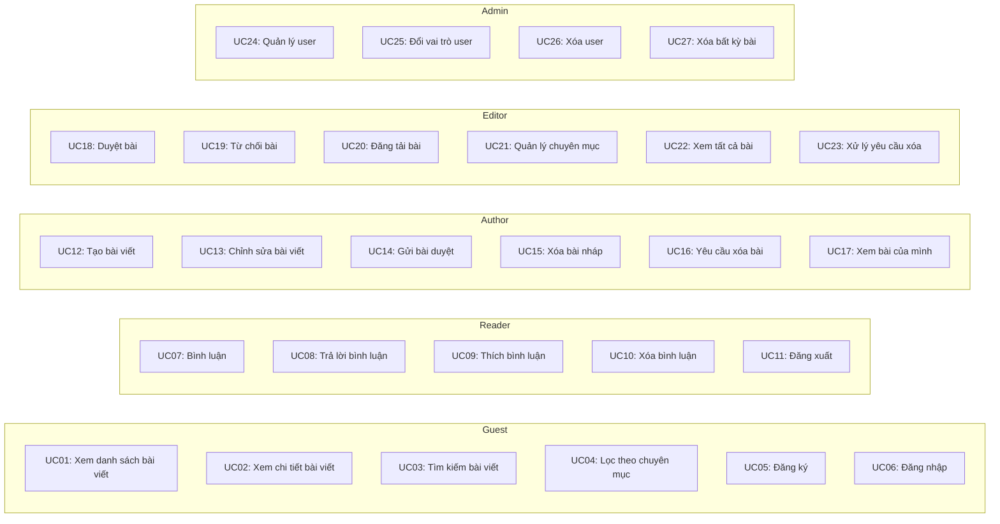
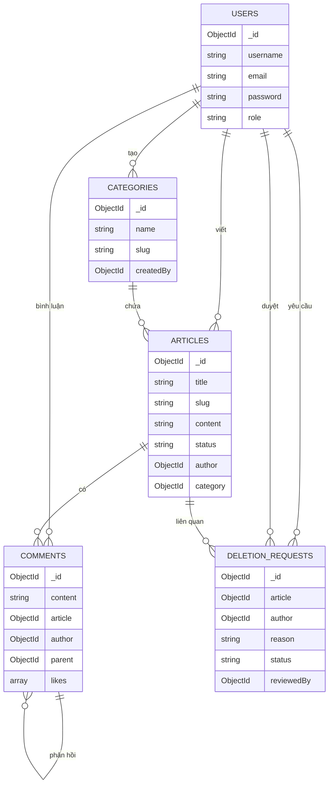
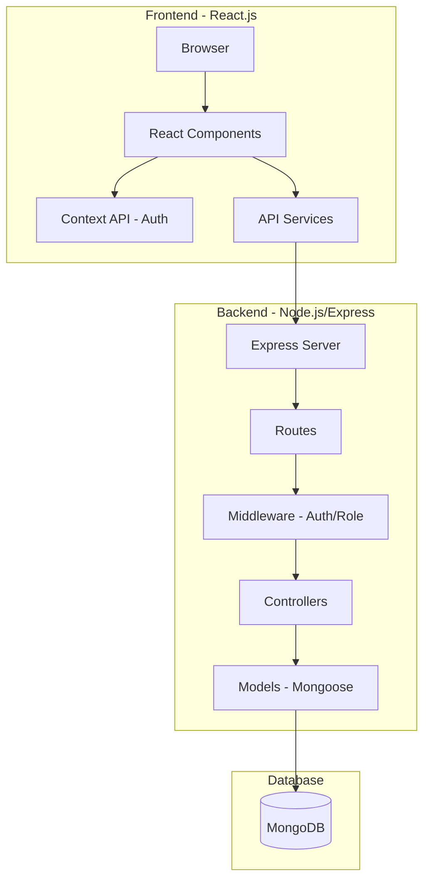

# BÁO CÁO ĐỒ ÁN
# HỆ THỐNG QUẢN LÝ TIN TỨC TRỰC TUYẾN - TINTUC24H

> **Môn học:** Cơ sở dữ liệu phi quan hệ  
> **Công nghệ sử dụng:** MongoDB, Node.js, Express.js, React.js

---

# MỤC LỤC

- **CHƯƠNG 1: TỔNG QUAN ĐỀ TÀI**
  - 1.1. Tên đề tài
  - 1.2. Mục tiêu đề tài
    - 1.2.1. Mục tiêu cụ thể
  - 1.3. Phạm vi đề tài
    - 1.3.1. Phạm vi không gian và đối tượng phục vụ
    - 1.3.2. Phạm vi chức năng
  - 1.4. Ý nghĩa thực tiễn
- **CHƯƠNG 2: PHÂN TÍCH HỆ THỐNG VÀ THIẾT KẾ HỆ THỐNG**
  - 2.1. Phân tích các Actor
  - 2.2. Phân tích Use Case
  - 2.3. Mô tả chi tiết các Use Case
  - 2.4. Thiết kế cơ sở dữ liệu
  - 2.5. Kiến trúc hệ thống
- **CHƯƠNG 3: KẾT LUẬN VÀ HƯỚNG PHÁT TRIỂN**
  - 3.1. Kết quả đạt được
  - 3.2. Hạn chế
  - 3.3. Hướng phát triển

---

# CHƯƠNG 1: TỔNG QUAN ĐỀ TÀI

## 1.1. Tên đề tài

**Xây dựng hệ thống quản lý tin tức trực tuyến TinTuc24h sử dụng cơ sở dữ liệu MongoDB**

## 1.2. Mục tiêu đề tài

Xây dựng một hệ thống website tin tức/báo chí hoàn chỉnh với các tính năng quản lý nội dung, phân quyền người dùng, và tương tác xã hội, sử dụng cơ sở dữ liệu phi quan hệ MongoDB để lưu trữ và quản lý dữ liệu.

### 1.2.1. Mục tiêu cụ thể

1. **Về mặt kỹ thuật:**
   - Xây dựng RESTful API backend sử dụng Node.js và Express.js
   - Thiết kế cơ sở dữ liệu phi quan hệ MongoDB với các collection phù hợp
   - Phát triển giao diện người dùng responsive với React.js
   - Triển khai hệ thống xác thực và phân quyền sử dụng JWT (JSON Web Token)

2. **Về mặt chức năng:**
   - Hệ thống phân quyền 4 vai trò: Admin, Editor, Author, Reader
   - Quản lý bài viết với quy trình duyệt bài (draft → pending → approved → published)
   - Hệ thống bình luận có phân cấp (nested comments)
   - Quản lý chuyên mục tin tức
   - Tính năng tự động thu thập tin tức từ nguồn RSS (VnExpress)

3. **Về mặt học thuật:**
   - Áp dụng kiến thức về cơ sở dữ liệu phi quan hệ vào thực tiễn
   - Hiểu rõ ưu điểm của MongoDB trong việc lưu trữ dữ liệu linh hoạt
   - Thực hành thiết kế schema và quan hệ trong NoSQL database

## 1.3. Phạm vi đề tài

### 1.3.1. Phạm vi không gian và đối tượng phục vụ

**Đối tượng phục vụ:**

| Vai trò | Mô tả |
|---------|-------|
| **Reader (Độc giả)** | Người dùng thông thường, có thể đọc bài viết, bình luận và thích bài viết |
| **Author (Tác giả)** | Người viết bài, có thể tạo và quản lý bài viết của mình |
| **Editor (Biên tập viên)** | Người duyệt bài, quản lý chuyên mục và nội dung |
| **Admin (Quản trị viên)** | Toàn quyền quản trị hệ thống, quản lý người dùng |

**Phạm vi không gian:**
- Hệ thống hoạt động trên nền tảng web
- Hỗ trợ truy cập từ máy tính và thiết bị di động (responsive design)
- Triển khai trên môi trường localhost cho mục đích phát triển và demo

### 1.3.2. Phạm vi chức năng

**Các chức năng chính của hệ thống:**

1. **Quản lý tài khoản và xác thực:**
   - Đăng ký tài khoản (Reader, Author)
   - Đăng nhập/Đăng xuất
   - Phân quyền theo vai trò

2. **Quản lý bài viết:**
   - CRUD bài viết (Create, Read, Update, Delete)
   - Quy trình duyệt bài (draft → pending → approved → published)
   - Lọc bài theo chuyên mục, tác giả, trạng thái
   - Tìm kiếm bài viết theo tiêu đề
   - Đếm lượt xem bài viết

3. **Quản lý chuyên mục:**
   - CRUD chuyên mục tin tức
   - Phân loại bài viết theo chuyên mục

4. **Hệ thống bình luận:**
   - Thêm bình luận cho bài viết
   - Trả lời bình luận (nested comments)
   - Thích/bỏ thích bình luận
   - Xóa bình luận

5. **Yêu cầu xóa bài viết:**
   - Tác giả gửi yêu cầu xóa bài đã đăng
   - Editor/Admin phê duyệt hoặc từ chối yêu cầu

6. **Thu thập tin tức tự động:**
   - Lấy tin từ RSS feed của VnExpress
   - Tự động phân loại vào chuyên mục

## 1.4. Ý nghĩa thực tiễn

1. **Ứng dụng thực tế:** Hệ thống có thể được áp dụng cho các trang tin tức, blog, tạp chí trực tuyến với quy mô vừa và nhỏ.

2. **Minh họa NoSQL:** Dự án minh họa rõ ràng cách sử dụng MongoDB trong việc:
   - Lưu trữ dữ liệu có cấu trúc linh hoạt (bài viết với nội dung đa dạng)
   - Xử lý quan hệ một-nhiều (bài viết - bình luận, user - bài viết)
   - Tối ưu hiệu suất truy vấn với indexing

3. **Kiến trúc hiện đại:** Sử dụng kiến trúc MERN stack (MongoDB, Express, React, Node.js) - một trong những stack phổ biến nhất hiện nay cho phát triển web full-stack.

---

# CHƯƠNG 2: PHÂN TÍCH HỆ THỐNG VÀ THIẾT KẾ HỆ THỐNG

## 2.1. Phân tích các Actor

Hệ thống TinTuc24h có **4 actor** chính, được phân cấp theo quyền hạn từ thấp đến cao:

### 2.1.1. Guest (Khách)

| Thuộc tính | Mô tả |
|------------|-------|
| **Định nghĩa** | Người dùng chưa đăng nhập vào hệ thống |
| **Quyền hạn** | Xem các bài viết đã được đăng tải (published), xem bình luận |
| **Hạn chế** | Không thể bình luận, thích bài viết, hoặc truy cập các chức năng quản lý |

### 2.1.2. Reader (Độc giả)

| Thuộc tính | Mô tả |
|------------|-------|
| **Định nghĩa** | Người dùng đã đăng ký và đăng nhập với vai trò reader |
| **Kế thừa từ** | Guest |
| **Quyền hạn bổ sung** | Bình luận bài viết, trả lời bình luận, thích bình luận |
| **Hạn chế** | Không thể viết bài hoặc quản lý nội dung |

### 2.1.3. Author (Tác giả)

| Thuộc tính | Mô tả |
|------------|-------|
| **Định nghĩa** | Người dùng có khả năng viết và quản lý bài viết |
| **Kế thừa từ** | Reader |
| **Quyền hạn bổ sung** | Tạo bài viết, chỉnh sửa bài viết của mình, gửi bài duyệt, xóa bài nháp, gửi yêu cầu xóa bài đã đăng |
| **Hạn chế** | Chỉ quản lý được bài viết của chính mình, không thể tự duyệt bài |

### 2.1.4. Editor (Biên tập viên)

| Thuộc tính | Mô tả |
|------------|-------|
| **Định nghĩa** | Người chịu trách nhiệm duyệt nội dung và quản lý chuyên mục |
| **Kế thừa từ** | Author |
| **Quyền hạn bổ sung** | Duyệt/từ chối bài viết, đăng tải bài viết, quản lý chuyên mục, xem tất cả bài viết, xử lý yêu cầu xóa bài |
| **Hạn chế** | Không thể quản lý người dùng |

### 2.1.5. Admin (Quản trị viên)

| Thuộc tính | Mô tả |
|------------|-------|
| **Định nghĩa** | Người có toàn quyền quản trị hệ thống |
| **Kế thừa từ** | Editor |
| **Quyền hạn bổ sung** | Quản lý toàn bộ người dùng, thay đổi vai trò người dùng, xóa người dùng, xóa bất kỳ bài viết nào |

### Sơ đồ phân cấp Actor



## 2.2. Phân tích Use Case

### 2.2.1. Danh sách Use Case theo Actor

#### Guest (Khách)
| UC ID | Tên Use Case | Mô tả |
|-------|--------------|-------|
| UC01 | Xem danh sách bài viết | Xem các bài viết đã published trên trang chủ |
| UC02 | Xem chi tiết bài viết | Xem nội dung đầy đủ của một bài viết |
| UC03 | Tìm kiếm bài viết | Tìm bài viết theo tiêu đề |
| UC04 | Lọc bài theo chuyên mục | Xem bài viết theo danh mục |
| UC05 | Đăng ký tài khoản | Tạo tài khoản mới (Reader hoặc Author) |
| UC06 | Đăng nhập | Đăng nhập vào hệ thống |

#### Reader (Độc giả)
| UC ID | Tên Use Case | Mô tả |
|-------|--------------|-------|
| UC07 | Bình luận bài viết | Thêm bình luận vào bài viết |
| UC08 | Trả lời bình luận | Reply bình luận của người khác |
| UC09 | Thích bình luận | Like/Unlike bình luận |
| UC10 | Xóa bình luận | Xóa bình luận của mình |
| UC11 | Đăng xuất | Đăng xuất khỏi hệ thống |

#### Author (Tác giả)
| UC ID | Tên Use Case | Mô tả |
|-------|--------------|-------|
| UC12 | Tạo bài viết | Viết bài mới (lưu nháp) |
| UC13 | Chỉnh sửa bài viết | Sửa bài viết của mình |
| UC14 | Gửi bài duyệt | Submit bài từ draft sang pending |
| UC15 | Xóa bài nháp | Xóa bài viết ở trạng thái draft |
| UC16 | Yêu cầu xóa bài đã đăng | Gửi request xóa bài published |
| UC17 | Xem bài viết của mình | Xem danh sách bài viết đã tạo |

#### Editor (Biên tập viên)
| UC ID | Tên Use Case | Mô tả |
|-------|--------------|-------|
| UC18 | Duyệt bài viết | Approve bài từ pending |
| UC19 | Từ chối bài viết | Reject bài (chuyển về draft) |
| UC20 | Đăng tải bài viết | Publish bài đã approved |
| UC21 | Quản lý chuyên mục | CRUD chuyên mục tin tức |
| UC22 | Xem tất cả bài viết | Xem toàn bộ bài viết trong hệ thống |
| UC23 | Xử lý yêu cầu xóa bài | Approve/Reject deletion request |

#### Admin (Quản trị viên)
| UC ID | Tên Use Case | Mô tả |
|-------|--------------|-------|
| UC24 | Quản lý người dùng | Xem danh sách user |
| UC25 | Thay đổi vai trò user | Cập nhật role của user |
| UC26 | Xóa người dùng | Xóa tài khoản user |
| UC27 | Xóa bất kỳ bài viết | Xóa bài viết của bất kỳ ai |

### 2.2.2. Sơ đồ Use Case tổng quan



## 2.3. Mô tả chi tiết các Use Case

### UC01: Xem danh sách bài viết

| Thuộc tính | Mô tả |
|------------|-------|
| **Actor** | Guest, Reader, Author, Editor, Admin |
| **Mô tả** | Người dùng xem danh sách các bài viết đã được đăng tải |
| **Tiền điều kiện** | Không có |
| **Hậu điều kiện** | Hiển thị danh sách bài viết với phân trang |
| **Luồng chính** | 1. Người dùng truy cập trang chủ<br>2. Hệ thống lấy danh sách bài viết có status = "published"<br>3. Hiển thị danh sách bài viết với thumbnail, title, excerpt, author, date<br>4. Hiển thị phân trang |
| **Luồng thay thế** | Không có bài viết nào: Hiển thị thông báo "Chưa có bài viết" |

### UC06: Đăng nhập

| Thuộc tính | Mô tả |
|------------|-------|
| **Actor** | Guest |
| **Mô tả** | Người dùng đăng nhập vào hệ thống |
| **Tiền điều kiện** | Người dùng đã có tài khoản |
| **Hậu điều kiện** | Người dùng được xác thực và nhận JWT token |
| **Luồng chính** | 1. Người dùng nhập username/email và password<br>2. Hệ thống xác thực thông tin<br>3. Hệ thống tạo JWT token<br>4. Chuyển hướng về trang chủ |
| **Luồng thay thế** | Sai thông tin: Hiển thị lỗi "Invalid credentials" |

### UC12: Tạo bài viết

| Thuộc tính | Mô tả |
|------------|-------|
| **Actor** | Author, Editor, Admin |
| **Mô tả** | Tác giả tạo bài viết mới |
| **Tiền điều kiện** | Người dùng đã đăng nhập với vai trò Author trở lên |
| **Hậu điều kiện** | Bài viết được tạo với status = "draft" |
| **Luồng chính** | 1. Người dùng truy cập trang tạo bài viết<br>2. Nhập thông tin: title, content, excerpt, thumbnail, category<br>3. Nhấn "Lưu nháp"<br>4. Hệ thống tạo bài viết mới<br>5. Chuyển về danh sách bài viết của tác giả |
| **Validation** | Title và Content là bắt buộc, Category phải được chọn |

### UC14: Gửi bài duyệt

| Thuộc tính | Mô tả |
|------------|-------|
| **Actor** | Author |
| **Mô tả** | Tác giả gửi bài viết để biên tập viên duyệt |
| **Tiền điều kiện** | Bài viết có status = "draft" và thuộc về người dùng |
| **Hậu điều kiện** | Bài viết chuyển status = "pending" |
| **Luồng chính** | 1. Tác giả chọn bài viết ở trạng thái draft<br>2. Nhấn "Gửi duyệt"<br>3. Hệ thống cập nhật status thành "pending" |

### UC18: Duyệt bài viết

| Thuộc tính | Mô tả |
|------------|-------|
| **Actor** | Editor, Admin |
| **Mô tả** | Biên tập viên phê duyệt bài viết |
| **Tiền điều kiện** | Bài viết có status = "pending" |
| **Hậu điều kiện** | Bài viết chuyển status = "approved" |
| **Luồng chính** | 1. Editor xem danh sách bài chờ duyệt<br>2. Chọn bài viết và xem preview<br>3. Nhấn "Approve"<br>4. Hệ thống cập nhật status thành "approved" |

### UC21: Quản lý chuyên mục

| Thuộc tính | Mô tả |
|------------|-------|
| **Actor** | Editor, Admin |
| **Mô tả** | Quản lý các chuyên mục tin tức |
| **Tiền điều kiện** | Người dùng đã đăng nhập với vai trò Editor hoặc Admin |
| **Hậu điều kiện** | Chuyên mục được tạo/sửa/xóa |
| **Luồng chính** | 1. Truy cập trang quản lý chuyên mục<br>2. Thực hiện thao tác: Thêm/Sửa/Xóa<br>3. Hệ thống cập nhật database |
| **Validation** | Tên chuyên mục phải unique, slug được tự động tạo từ tên |

## 2.4. Thiết kế cơ sở dữ liệu

### 2.4.1. Mô hình dữ liệu MongoDB

Hệ thống sử dụng **MongoDB** với 5 collection chính:

### Collection: Users

```javascript
{
    _id: ObjectId,
    username: String (required, unique, min: 3),
    email: String (required, unique, lowercase),
    password: String (required, min: 6, hashed với bcrypt),
    role: String (enum: ['admin', 'editor', 'author', 'reader'], default: 'reader'),
    createdAt: Date,
    updatedAt: Date
}
```

### Collection: Articles

```javascript
{
    _id: ObjectId,
    title: String (required),
    slug: String (required, unique, auto-generated),
    content: String (required),
    excerpt: String,
    thumbnail: String,
    author: ObjectId (ref: 'User', required),
    category: ObjectId (ref: 'Category', required),
    status: String (enum: ['draft', 'pending', 'approved', 'rejected', 'published'], 
                    default: 'draft'),
    views: Number (default: 0),
    publishedAt: Date,
    createdAt: Date,
    updatedAt: Date
}
```

### Collection: Categories

```javascript
{
    _id: ObjectId,
    name: String (required, unique),
    slug: String (required, unique, auto-generated),
    description: String,
    createdBy: ObjectId (ref: 'User', required),
    createdAt: Date,
    updatedAt: Date
}
```

### Collection: Comments

```javascript
{
    _id: ObjectId,
    content: String (required, max: 1000),
    article: ObjectId (ref: 'Article', required),
    author: ObjectId (ref: 'User', required),
    parent: ObjectId (ref: 'Comment', default: null),  // Cho nested comments
    likes: [ObjectId] (array of User refs),
    createdAt: Date,
    updatedAt: Date
}
// Index: { article: 1, createdAt: -1 }
```

### Collection: DeletionRequests

```javascript
{
    _id: ObjectId,
    article: ObjectId (ref: 'Article', required),
    author: ObjectId (ref: 'User', required),
    reason: String (required, min: 10, max: 500),
    status: String (enum: ['pending', 'approved', 'rejected'], default: 'pending'),
    reviewedBy: ObjectId (ref: 'User'),
    reviewedAt: Date,
    createdAt: Date,
    updatedAt: Date
}
// Indexes: { article: 1, status: 1 }, { author: 1, status: 1 }
```

### 2.4.2. Sơ đồ quan hệ giữa các Collection



## 2.5. Kiến trúc hệ thống

### 2.5.1. Kiến trúc tổng quan

Hệ thống được xây dựng theo mô hình **Client-Server** với kiến trúc **MERN Stack**:



### 2.5.2. Cấu trúc thư mục

```
news-website/
├── backend/
│   ├── config/           # Cấu hình database
│   │   └── db.js
│   ├── controllers/      # Business logic
│   │   ├── article.controller.js
│   │   ├── auth.controller.js
│   │   ├── category.controller.js
│   │   ├── comment.controller.js
│   │   ├── deletionRequest.controller.js
│   │   └── user.controller.js
│   ├── middleware/       # Xác thực & phân quyền
│   │   └── auth.middleware.js
│   ├── models/           # MongoDB Schemas
│   │   ├── Article.js
│   │   ├── Category.js
│   │   ├── Comment.js
│   │   ├── DeletionRequest.js
│   │   └── User.js
│   ├── routes/           # API Routes
│   │   ├── article.routes.js
│   │   ├── auth.routes.js
│   │   ├── category.routes.js
│   │   ├── comment.routes.js
│   │   ├── deletionRequest.routes.js
│   │   └── user.routes.js
│   ├── scripts/          # Utility scripts
│   └── server.js         # Entry point
│
└── frontend/
    ├── src/
    │   ├── components/   # React Components
    │   ├── context/      # Auth Context
    │   ├── pages/        # Page Components
    │   │   ├── admin/    # Admin Dashboard
    │   │   ├── author/   # Author Dashboard
    │   │   ├── editor/   # Editor Dashboard
    │   │   ├── HomePage.jsx
    │   │   ├── ArticleDetail.jsx
    │   │   ├── Login.jsx
    │   │   └── Register.jsx
    │   └── services/     # API Services
    └── index.html
```

### 2.5.3. API Endpoints

#### Authentication
| Method | Endpoint | Mô tả | Access |
|--------|----------|-------|--------|
| POST | `/api/auth/register` | Đăng ký tài khoản | Public |
| POST | `/api/auth/login` | Đăng nhập | Public |
| GET | `/api/auth/me` | Lấy thông tin user hiện tại | Private |

#### Articles
| Method | Endpoint | Mô tả | Access |
|--------|----------|-------|--------|
| GET | `/api/articles` | Lấy danh sách bài viết | Public/Private |
| GET | `/api/articles/:id` | Lấy chi tiết bài viết | Public/Private |
| GET | `/api/articles/slug/:slug` | Lấy bài viết theo slug | Public/Private |
| POST | `/api/articles` | Tạo bài viết mới | Author+ |
| PUT | `/api/articles/:id` | Cập nhật bài viết | Author (owner) |
| DELETE | `/api/articles/:id` | Xóa bài viết | Author (draft) / Admin |
| PUT | `/api/articles/:id/submit` | Gửi bài duyệt | Author |
| PUT | `/api/articles/:id/status` | Cập nhật trạng thái | Editor+ |
| PUT | `/api/articles/:id/publish` | Đăng bài | Editor+ |

#### Categories
| Method | Endpoint | Mô tả | Access |
|--------|----------|-------|--------|
| GET | `/api/categories` | Lấy danh sách chuyên mục | Public |
| POST | `/api/categories` | Tạo chuyên mục | Editor+ |
| PUT | `/api/categories/:id` | Cập nhật chuyên mục | Editor+ |
| DELETE | `/api/categories/:id` | Xóa chuyên mục | Admin |

#### Comments
| Method | Endpoint | Mô tả | Access |
|--------|----------|-------|--------|
| GET | `/api/articles/:articleId/comments` | Lấy bình luận | Public |
| POST | `/api/articles/:articleId/comments` | Thêm bình luận | Reader+ |
| PUT | `/api/comments/:id` | Sửa bình luận | Owner |
| DELETE | `/api/comments/:id` | Xóa bình luận | Owner/Admin |
| POST | `/api/comments/:id/like` | Like/Unlike | Reader+ |

#### Users (Admin only)
| Method | Endpoint | Mô tả | Access |
|--------|----------|-------|--------|
| GET | `/api/users` | Lấy danh sách user | Admin |
| PUT | `/api/users/:id/role` | Đổi vai trò | Admin |
| DELETE | `/api/users/:id` | Xóa user | Admin |

---

# CHƯƠNG 3: KẾT LUẬN VÀ HƯỚNG PHÁT TRIỂN

## 3.1. Kết quả đạt được

### 3.1.1. Về mặt chức năng

Hệ thống TinTuc24h đã hoàn thành các chức năng chính:

✅ **Hệ thống xác thực và phân quyền:**
- Đăng ký/Đăng nhập với JWT token
- Phân quyền 4 vai trò: Admin, Editor, Author, Reader
- Middleware bảo vệ các route theo vai trò

✅ **Quản lý bài viết hoàn chỉnh:**
- CRUD bài viết với đầy đủ thông tin (title, content, excerpt, thumbnail, category)
- Quy trình duyệt bài 5 trạng thái: draft → pending → approved → published (và rejected)
- Tự động tạo slug từ tiêu đề
- Đếm lượt xem bài viết

✅ **Hệ thống bình luận:**
- Bình luận đa cấp (nested comments)
- Like/Unlike bình luận
- Xóa bình luận có tính năng cascade (xóa cả replies)

✅ **Quản lý chuyên mục:**
- CRUD chuyên mục với slug tự động
- Lọc bài viết theo chuyên mục

✅ **Tính năng bổ sung:**
- Tìm kiếm bài viết theo tiêu đề
- Phân trang danh sách bài viết
- Yêu cầu xóa bài viết đã đăng
- Script tự động thu thập tin từ VnExpress RSS

### 3.1.2. Về mặt kỹ thuật

✅ **Backend:**
- RESTful API với Express.js
- Mongoose ODM cho MongoDB
- JWT authentication
- Password hashing với bcrypt
- Role-based access control

✅ **Frontend:**
- Single Page Application với React.js
- Responsive design với Tailwind CSS
- Context API cho state management
- Dashboard riêng cho từng vai trò

✅ **Database:**
- Thiết kế schema MongoDB hợp lý
- Sử dụng references và population
- Indexing cho tối ưu query

## 3.2. Hạn chế

1. **Chưa có upload file/image:** Hiện tại thumbnail lưu dưới dạng URL, chưa có tính năng upload trực tiếp.

2. **Chưa có notification system:** Tác giả không nhận được thông báo khi bài được duyệt/từ chối.

3. **Chưa có rich text editor:** Content bài viết chưa hỗ trợ định dạng phong phú.

4. **Chưa có caching:** Chưa implement Redis cache để tối ưu hiệu suất.

5. **Chưa có unit tests:** Chưa có test coverage cho backend API.

## 3.3. Hướng phát triển

### Ngắn hạn
1. Thêm tính năng upload hình ảnh với Cloudinary hoặc AWS S3
2. Tích hợp rich text editor (TinyMCE, CKEditor)
3. Thêm hệ thống thông báo realtime với Socket.io
4. Implement caching với Redis

### Trung hạn
1. Thêm tính năng like bài viết
2. Thêm tính năng bookmark/save bài viết
3. Tích hợp OAuth (Google, Facebook login)
4. Thêm dashboard analytics (thống kê views, comments)

### Dài hạn
1. Triển khai lên cloud (AWS, Heroku, hoặc Vercel)
2. Containerization với Docker
3. CI/CD pipeline
4. Mobile app với React Native

---

# PHỤ LỤC

## A. Yêu cầu hệ thống

| Thành phần | Phiên bản |
|------------|-----------|
| Node.js | v14.0.0 trở lên |
| MongoDB | v4.0 trở lên |
| npm/yarn | Phiên bản mới nhất |

## B. Hướng dẫn cài đặt

```bash
# Clone project
git clone <repository-url>
cd news-website

# Cài đặt Backend
cd backend
npm install
cp .env.example .env
# Cập nhật MONGODB_URI và JWT_SECRET trong .env

# Tạo tài khoản Admin
npm run create-admin

# Chạy Backend
npm run dev

# Cài đặt và chạy Frontend (terminal khác)
cd frontend
npm install
npm run dev
```

## C. Tài khoản mặc định

| Thông tin | Giá trị |
|-----------|---------|
| Username | admin |
| Email | admin@tintuc24h.com |
| Password | 123456 |
| Role | admin |

---

> **Ghi chú:** Báo cáo này được tạo dựa trên phân tích source code dự án TinTuc24h.
